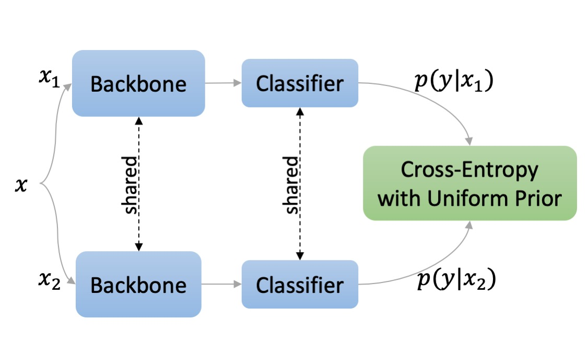

# DD2412 - Deep Learning, Advance Course

## Self-Classifier: Self-Supervised Classification Network

Re-implementation of the paper [Self-Supervised Classification Network](https://arxiv.org/abs/2103.10994) from ECCV 2022.

Self-Classifier architecture. Two augmented views of the same image are processed by a shared network comprised of a backbone (e.g. CNN) and a classifier (e.g. projection MLP + linear classification head). The cross-entropy of the two views is minimized to promote same class prediction while avoiding degenerate solutions by asserting a uniform prior on class predictions. The resulting model learns representations and discovers the underlying classes in a single-stage end-to-end unsupervised manner.

### Setup

1. Instal Apex with CUDA extension:
      
        git clone https://github.com/NVIDIA/apex
        cd apex
        pip install -v --disable-pip-version-check --no-cache-dir --global-option="--cpp_ext" --global-option="--cuda_ext" ./

2. Install all dependencies

### Dataset

The data can be find here: [CIFAR10](https://www.kaggle.com/datasets/swaroopkml/cifar10-pngs-in-folders)

Extract data under your code folder 

      src/cifar10/cifar10
                  |train
                  |val

### Unsupervised Image Classification

#### Training

      python train.py --config configs/train100ep.yaml
      

#### Testing

      python test.py --config configs/test.yaml      

### Image Classification with Linear Models 

#### Training

      python lincls_test.py --config configs/lincls_train.yaml
      

#### Testing

      python lincls_test.py --config configs/lincls_test.yaml 
